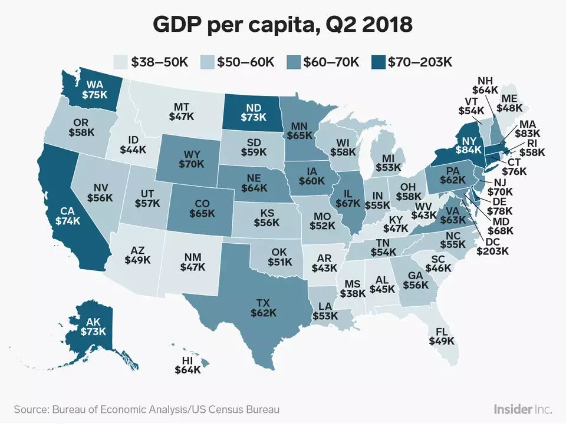
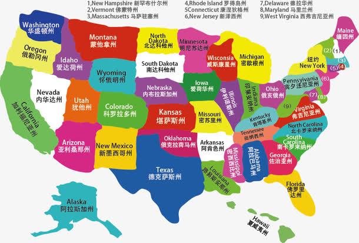
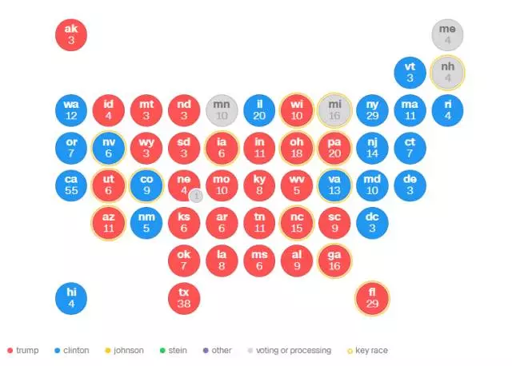
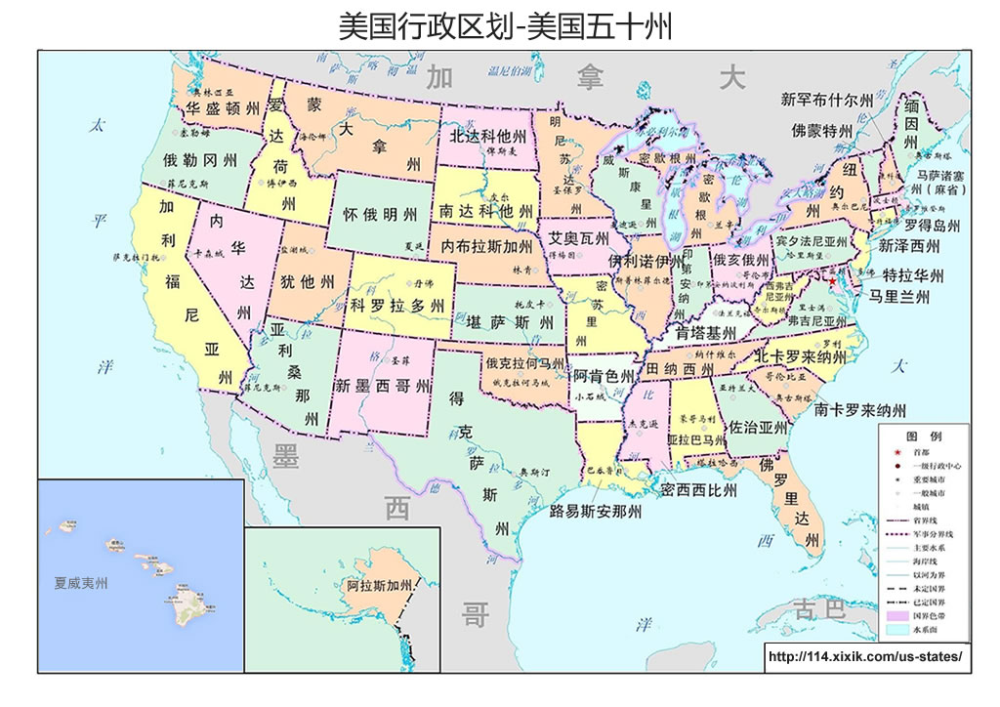

美利坚合众国（英语：United States of America），简称“美国”（United States），是由华盛顿哥伦比亚特区、50个州和关岛等众多海外领土组成的联邦共和立宪制国家。其主体部分位于北美洲中部，美国中央情报局《世界概况》1989年至1996年初始版美国总面积是937.3万平方公里，人口3.3亿，通用英语，是一个移民国家。

主要城市：华盛顿（首都），纽约，洛杉矶，芝加哥，休斯顿，费城，旧金山，波士顿，匹兹堡。

美国横跨西五区至西十区，共六个时区。每个时区对应一个标准时间，从东向西分别为东部时间（EST，西五区，包括大西洋沿岸及近大陆的19个州和华盛顿特区，代表城市是华盛顿）、中部时间（CST，西六区，包括芝加哥和新奥尔良两个地区）、山地时间（MST，西七区）、太平洋时间（PST，西八区，包括太平洋沿岸的4个州，有洛杉矶等城市）、阿拉斯加时间（AKST，西九区）、夏威夷时间（HST，西十区）。按照“东早西晚”的规律，各递减一小时。所谓西部时间是指太平洋时间。

美国首都为华盛顿，全称华盛顿哥伦比亚特区（Washington D. C.），位于美国东北部，1790年定都，人口约70万。除首都所在的特区外，全国分为50个州，主要的州有 加利福尼亚州（首府萨克拉门托），佐治亚州（首府亚特兰大），肯塔基州（首府法兰克福），马萨诸塞州（首府波士顿），南卡莱罗纳州（首府哥伦比亚），德克萨斯州（首府奥斯丁），纽约州（首府奥尔巴尼），明尼苏达州（首府圣保罗）。

美国国旗主体由13道红、白相间的宽条组成，7道红条，6道白条13道宽条代表最早发动独立战争并取得胜利的13个州，50颗五角星代表美利坚合众国的州数。

1961年美国国会通过决议，正式承认“山姆大叔”为美国的象征。

美国人口约3.30亿（截至2019年1月）。非拉美裔白人约占62.1%；拉美裔约占17.4%，非洲裔约占13.2%，亚裔约占5.4%，混血约占2.5%，印第安人和阿拉斯加原住民约占1.2%，夏威夷原住民或其他太平洋岛民约占0.2%（少部分人在其他族群内被重复统计）。

实行总统制。总统是国家元首、政府首脑兼武装部队总司令。总统通过间接选举产生，任期四年。政府内阁由总统、副总统、各部部长和总统指定的其他成员组成。内阁实际上只起总统助手和顾问团的作用，没有集体决策的权力。

共和党（Republican Party）：共和党人艾森豪威尔（1953），尼克松（1969），福特（1974），里根（1981），乔治·H·W·布什（1989），乔治·W·布什（2001），特朗普（2017）先后当选总统执政。

民主党（Democratic Party）：民主党人罗斯福（1933），杜鲁门（1945），肯尼迪（1961），约翰逊（1963），卡特（1977），克林顿（1993），奥巴马（2009）先后当选总统执政。

目前，美国主要商业银行有：

（1）摩根大通（J. P. Morgan Chase） ：2000年12月由J．P．摩根公司和大通-曼哈顿公司合并而成，总部设在纽约。

（2）美国银行（Bank of America Corp）：原中文名“美国美洲银行”，创建于1968年10月，总部设在旧金山。

（3）富国银行（Wells Fargo）：创立于1852年，总部设在旧金山，是美国唯一一家获得AAA评级的银行。

（4）花旗集团（Citigroup）：1955年纽约花旗银行与纽约第一银行合并，改名为纽约第一花旗银行，1962年改为第一花旗银行，1967年改为花旗公司。总部设在纽约。1998年与旅行者集团合并组建花旗集团，成为世界上最大的金融服务公司。

美国的文化产业非常发达，产值占GDP的20%左右，其总体竞争力位居世界首位。

2004年全世界前30个最繁忙的机场中有17个位于美国，包括了排名第一的亚特兰大哈兹菲尔德-杰克逊国际机场（Hartsfield-Jackson Atlanta International Airport）。以运货量而言，在同一年里，全世界前30个最繁忙的货运机场有12个在美国，包括了排名第一的孟菲斯国际机场（MEM）。

美国国家科学院、美国国家工程院、美国国家医学院和美国国家自然基金会，是美国科学界最高水平的四大学术机构。除自然基金会外，其他三院分别授予院士头衔。

总统山，全名拉什莫尔山国家纪念公园、美国总统公园，是一座坐落于南达科他州基斯通附近的美利坚合众国总统纪念公园。公园内有四座高达60英尺的美国前总统头像，分别是乔治·华盛顿、托马斯·杰弗逊、西奥多·罗斯福和亚伯拉罕·林肯，这四位总统被认为代表了美国建国150年来的历史。

马萨诸塞州：哈佛大学，麻省理工学院（MIT）

新泽西州：普林斯顿大学

康涅狄格州：耶鲁大学

加利福尼亚州：斯坦福大学，加州理工学院，加州大学伯克利分校，加州大学洛杉矶分校，南加州大学，加利福尼亚大学圣地亚哥分校，加州大学圣塔芭芭拉分校

宾夕法尼亚州：宾夕法尼亚大学，卡内基梅隆大学

纽约：哥伦比亚大学，康奈尔大学，纽约大学，罗切斯特大学

北卡罗来纳：杜克大学

伊利诺伊州：芝加哥大学，西北大学，伊利诺伊大学厄本那—香槟分校

新罕布什尔：新罕布什尔

密苏里：圣路易斯华盛顿大学

马里兰：约翰霍普金斯大学

罗德岛：布朗大学

德克萨斯州：莱斯大学，德克萨斯大学奥斯汀分校 

佐治亚州：埃默里大学，佐治亚理工学院

华盛顿：乔治城大学，华盛顿大学

弗吉尼亚州：弗吉尼亚大学

密西根：密西根大学-安娜堡分校

因此主要大学集中在：马萨诸塞州，加利福尼亚州，纽约，伊利诺伊州，基本上就是美国东西海岸。

从经济地图上分析，比较富裕的州为纽约州，马萨诸塞州，加州，康尼狄格州，阿拉斯加州。美国东西海岸的经济发展的较好。

2017年的大选结果分布，选举人票一共538张。除内布拉斯加州、缅因州外，凡赢得该州民众普选的候选人即赢得该州的所有选举人票，因此率先获得270张选举人票的候选人即当选美国总统。

如果只从这个地图来看，能明显影响美国政治的州是加州（55），德克萨斯州（38），纽约州（29），佛罗里达州（29）， 宾夕法尼亚州（20），俄亥俄州（18），佐治亚州（16），北卡罗来纳州（15），弗吉尼亚州（13），，华盛顿州（12），马萨诸塞州（11），伊利诺斯州（11），亚利桑那州（11）。

美国接壤的国家很少，从地图看只有加拿大，墨西哥，与古巴隔海相望。
